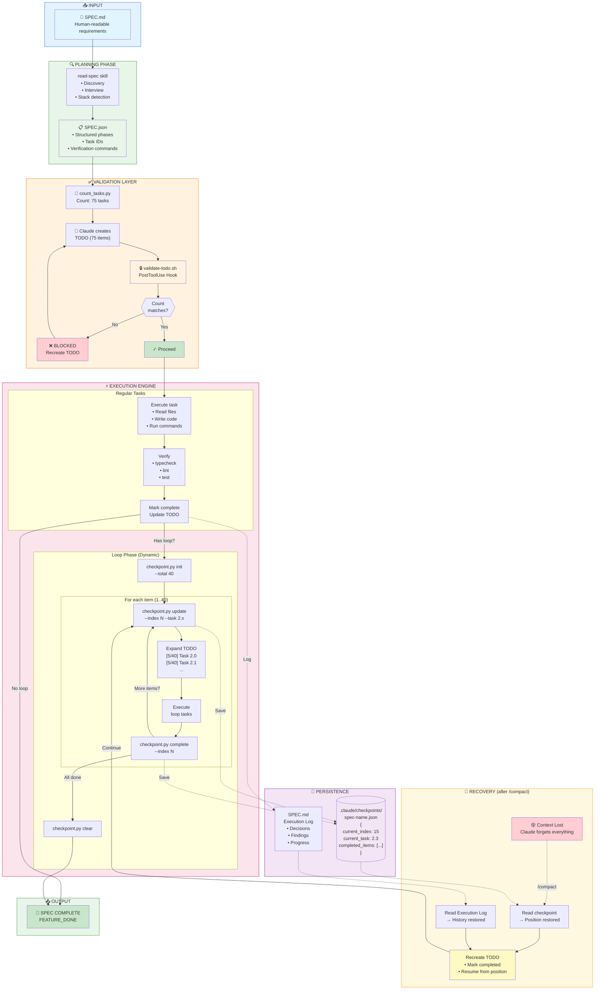

# SPEC Executor - Complete Architecture



## Legend

| Symbol | Meaning |
|--------|---------|
| 📄 | Human-readable file |
| 📋 | Structured JSON |
| 🔢 | Script |
| 📝 | TODO list |
| 🔒 | Hook (automatic validation) |
| ⚡ | Execution |
| 💾 | Persistence |
| 🔄 | Recovery |
| ✓ | Success |
| ❌ | Blocked |

## Key Flows

### 1. Normal Execution (No Loops)
```
SPEC.md → read-spec → SPEC.json → count → TODO → hook ✓ → execute → complete
```

### 2. Loop Execution
```
... → enter loop → init checkpoint → [update → expand → execute → complete] × N → clear → ...
```

### 3. Recovery After /compact
```
context lost → read checkpoint → read log → recreate TODO → resume from saved position
```
