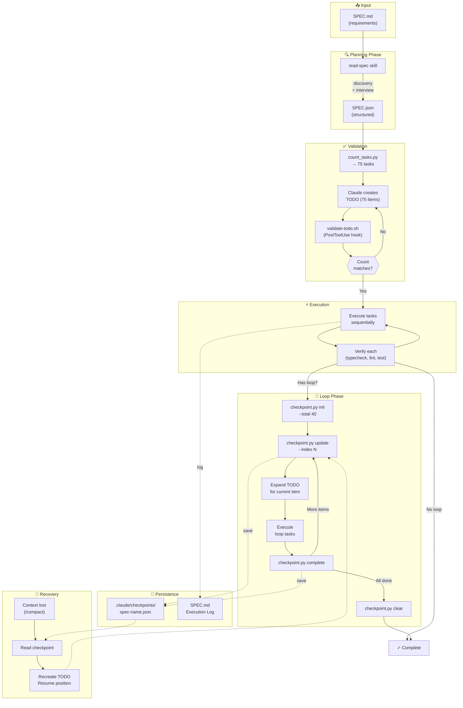
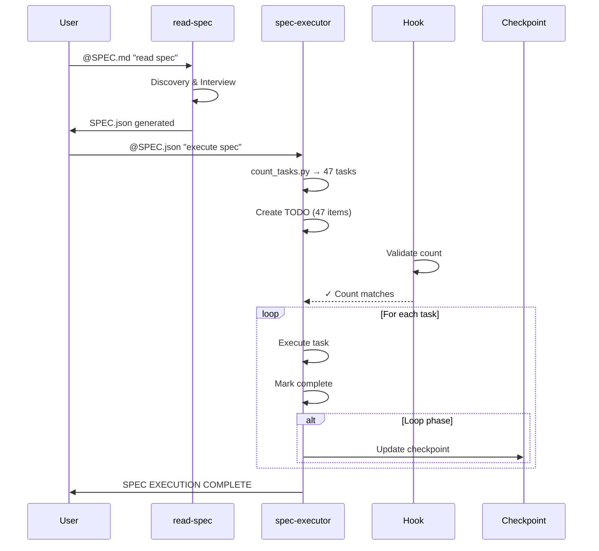
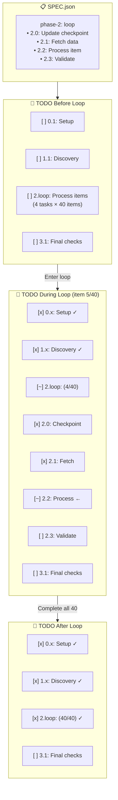
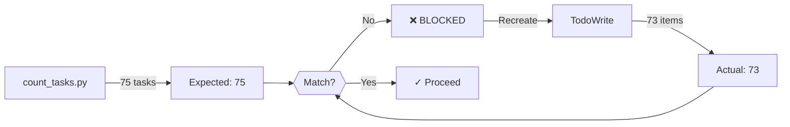
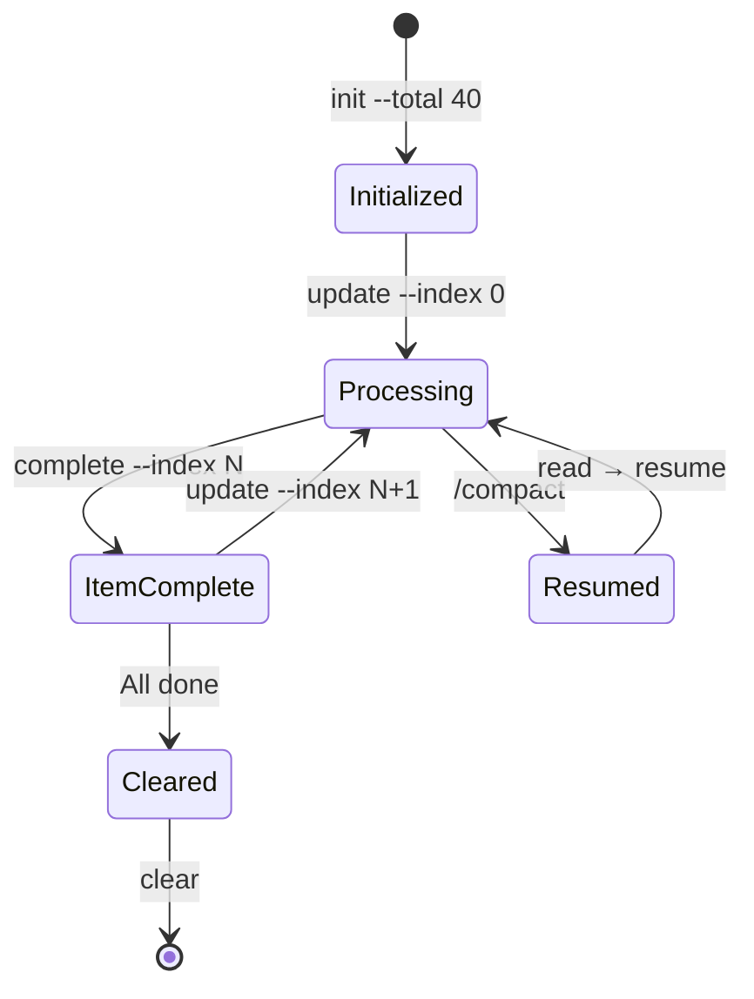
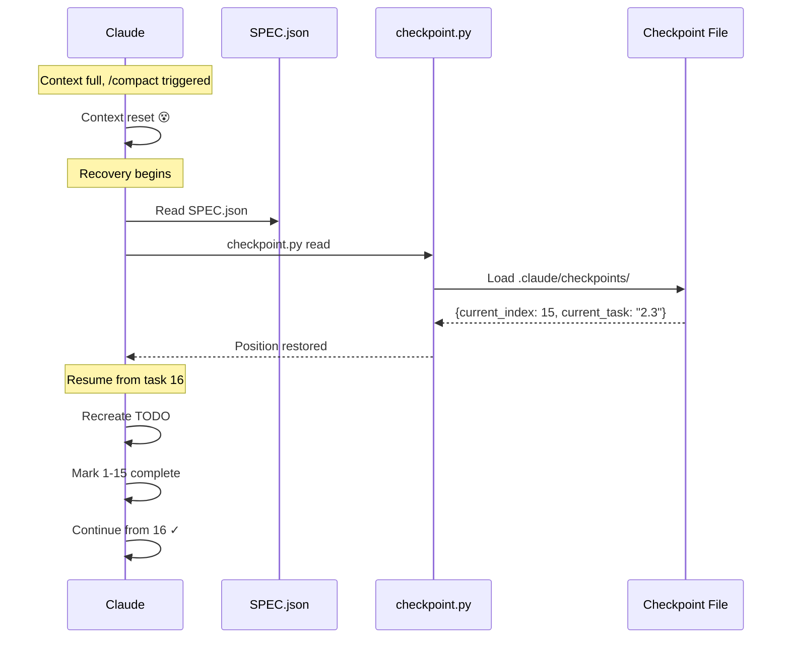
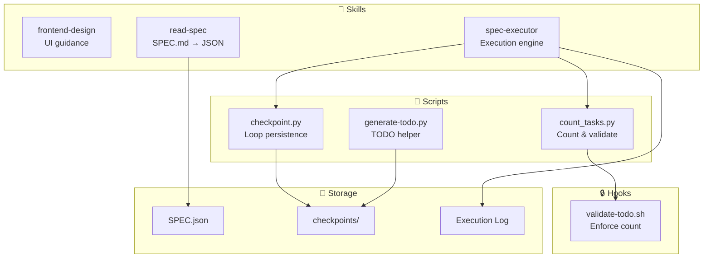

# SPEC Executor - Architecture

Detailed diagrams for the plugin's internals.

---

## Complete Flow

---

## The Workflow (Sequence)

---

## Loop Phase Expansion

---

## TODO Validation Hook

---

## Checkpoint State Machine

---

## Recovery Flow

---

## Component Roles

---

## Legend

| Symbol | Meaning |
|--------|---------|
| 📥 | Input |
| 🔍 | Planning/Discovery |
| ✅ | Validation |
| ⚡ | Execution |
| 🔄 | Loop/Recovery |
| 💾 | Persistence |
| ✓ | Success |
| ❌ | Blocked |
