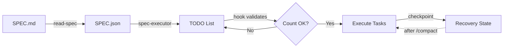

# SPEC Executor

> Autonomous execution of long-running tasks in Claude Code with guaranteed TODO tracking and checkpoint-based recovery.

[](https://claude.ai/code)
[](LICENSE)
[](#stack-configuration)

---

## Why This Plugin?

When Claude Code executes long tasks (hours), it faces critical challenges:

| Problem | What Happens | Solution |
|---------|--------------|----------|
| **Context Loss** | After `/compact`, Claude forgets progress | Checkpoint files persist state |
| **TODO Drift** | Tasks get skipped or miscounted | Hook validates exact count |
| **Loop State Loss** | Iteration position forgotten | External checkpoint tracks position |
| **Inconsistent Execution** | Different runs, different approaches | Structured SPEC.json format |

---

## Installation

### Prerequisites

- **Python 3.10+**
- **jq** (for hook validation)

```bash
# macOS
brew install jq

# Ubuntu/Debian
sudo apt install jq
```

### Install Plugin

```bash
# Clone the repo
git clone https://github.com/Girolino/claude-spec-executor.git

# Install to user scope (available in all projects)
claude plugin install ./claude-spec-executor --scope user
```

---

## Usage

### Step 1: Create SPEC.md

Create a `SPEC.md` file in your project root describing what you want to build:

```markdown
# Feature: User Authentication

## Requirements
- Login with email/password
- OAuth with Google
- Password reset flow
- Session management

## Constraints
- Use existing database schema
- Follow project conventions
```

### Step 2: Generate SPEC.json

```
Run /read-spec on SPEC.md
```

Claude will:
1. Discover your project structure
2. Ask clarifying questions
3. Generate structured `SPEC.json`

### Step 3: Clear Session

```
/clear
```

Start fresh session with clean context.

### Step 4: Execute

In **Plan Mode**:

```
Run /spec-executor for planning and run the SPEC
```

Claude executes autonomously until completion.

---

## How It Works



**Key components:**
- **read-spec**: Interviews user, generates SPEC.json
- **spec-executor**: Executes with TODO tracking
- **validate-todo.sh**: Hook that enforces exact task count
- **checkpoint.py**: Persists loop state for recovery

See [ARCHITECTURE.md](ARCHITECTURE.md) for detailed diagrams.

---

## Skills

| Skill | Trigger | What It Does |
|-------|---------|--------------|
| `read-spec` | "read spec", @SPEC.md | Interview + generate SPEC.json |
| `spec-executor` | "execute spec", @SPEC.json | Execute with TODO validation |
| `frontend-design` | UI building | Design system discovery + guidance |

---

## Stack Configuration

The plugin is **stack-agnostic**. Your SPEC.json defines the commands:

```json
{
  "stack": {
    "runtime": "bun",
    "framework": "nextjs",
    "database": "convex"
  },
  "verification_commands": {
    "typecheck": "bunx tsc --noEmit",
    "lint": "bun run lint",
    "build": "bun run build",
    "db_sync": "bunx convex dev --once"
  }
}
```

### Templates

| Template | Stack | Use Case |
|----------|-------|----------|
| [stack-convex-nextjs.md](templates/stack-convex-nextjs.md) | Convex + Next.js | Real-time apps |
| [stack-prisma-express.md](templates/stack-prisma-express.md) | Prisma + Express | REST APIs |
| [SPEC-example.json](templates/SPEC-example.json) | Generic | Starting point |

---

## Loop Phases

For tasks that iterate over dynamic items (e.g., process 40 profiles):

```
BEFORE loop:  [ ] 2.loop: Process items (4 tasks × 40 items)
DURING loop:  [~] 2.loop: (5/40) → [x] 2.0 [x] 2.1 [~] 2.2 [ ] 2.3
AFTER loop:   [x] 2.loop: Process items (40/40) ✓
```

Checkpoints persist position for recovery after `/compact`.

---

## File Structure

```
spec-executor/
├── .claude-plugin/plugin.json     # Plugin manifest
├── skills/
│   ├── frontend-design/SKILL.md   # UI design guidance
│   ├── read-spec/SKILL.md         # Planning & interview
│   └── spec-executor/
│       ├── SKILL.md               # Execution engine
│       └── scripts/
│           ├── checkpoint.py      # Loop state management
│           ├── count_tasks.py     # Task counting
│           └── generate-todo.py   # TODO generation
├── hooks/
│   ├── hooks.json                 # Hook configuration
│   └── validate-todo.sh           # Count validation
├── templates/                     # Stack examples
├── ARCHITECTURE.md                # Detailed diagrams
└── README.md
```

---

## Recovery After /compact

**Without loops:** Read SPEC.md Execution Log → Recreate TODO → Resume

**With loops:**
```bash
python3 checkpoint.py read my-spec
# → {"current_index": 15, "current_task": "2.3"}
# Resume from item 16
```

---

## License

MIT © 2026

---

<p align="center">
  <strong>Built for autonomous, long-running Claude Code sessions</strong><br>
  <sub>Because AI shouldn't forget what it was doing</sub>
</p>
