# 🚀 SPEC Executor

> Autonomous execution of long-running tasks in Claude Code with guaranteed TODO tracking and checkpoint-based recovery.

[](https://claude.ai/code)
[](LICENSE)
[](#stack-configuration)

---

## Why This Plugin?

When Claude Code executes long tasks (hours), it faces critical challenges:

| Problem | What Happens | This Plugin's Solution |
|---------|--------------|------------------------|
| **Context Loss** | After `/compact`, Claude forgets progress | Checkpoint files persist loop state |
| **TODO Drift** | Tasks get skipped or miscounted | Hook validates exact count match |
| **Loop State Loss** | Iteration position forgotten | External checkpoint tracks position |
| **Inconsistent Execution** | Different runs, different approaches | Structured SPEC.json format |

---

## How It Works


### The Workflow


---

## Architecture

```mermaid
block-beta
    columns 3

    block:input:1
        SPEC_MD["📄 SPEC.md\n(requirements)"]
    end

    block:planning:1
        READ_SPEC["🔍 read-spec\n(skill)"]
    end

    block:structured:1
        SPEC_JSON["📋 SPEC.json\n(structured)"]
    end

    SPEC_MD --> READ_SPEC
    READ_SPEC --> SPEC_JSON

    space:3

    block:executor:3
        columns 3
        COUNT["🔢 count_tasks.py"]
        TODO["📝 TODO List"]
        HOOK["🔒 validate-todo.sh\n(hook)"]

        COUNT --> TODO
        TODO --> HOOK
    end

    SPEC_JSON --> COUNT

    space:3

    block:execution:3
        columns 4
        TASK1["Task 0.1 ✓"]
        TASK2["Task 0.2 ✓"]
        DOTS["..."]
        TASKN["Task N.N"]
    end

    HOOK --> TASK1
    TASK1 --> TASK2
    TASK2 --> DOTS
    DOTS --> TASKN

    space:3

    block:checkpoint:3
        columns 2
        CP_FILE["💾 .claude/checkpoints/\nspec-name.json"]
        RECOVERY["🔄 /compact Recovery\nResume from saved position"]
    end

    TASKN --> CP_FILE
    CP_FILE --> RECOVERY
```



### Component Roles

```mermaid
flowchart TB
    subgraph Skills["🎯 Skills (Auto-invoked)"]
        FD["🎨 frontend-design\nUI design guidance"]
        RS["📋 read-spec\nSPEC.md → SPEC.json"]
        SE["⚡ spec-executor\nExecution engine"]
    end

    subgraph Scripts["🔧 Scripts"]
        CT["count_tasks.py\nCount & validate structure"]
        CP["checkpoint.py\nLoop state persistence"]
        GT["generate-todo.py\nTODO regeneration"]
    end

    subgraph Hooks["🔒 Hooks"]
        VT["validate-todo.sh\nEnforce exact count"]
    end

    subgraph Storage["💾 Persistence"]
        JSON["SPEC.json\nTask definitions"]
        CHK[".claude/checkpoints/\nLoop progress"]
        LOG["SPEC.md Execution Log\nHuman-readable history"]
    end

    RS --> JSON
    SE --> CT
    CT --> VT
    SE --> CP
    CP --> CHK
    SE --> LOG
    GT --> CHK
```



### The Recovery Flow


---

## Quick Start

### Prerequisites

- **Python 3.10+** (for scripts)
- **jq** (for hook validation)

```bash
# macOS
brew install jq

# Ubuntu/Debian
sudo apt install jq

# Verify installation
jq --version
```

### 1. Install the Plugin

```bash
# Install to user scope (available in all projects)
claude plugin install /path/to/spec-executor --scope user

# Or development mode
claude --plugin-dir /path/to/spec-executor
```

### 2. Setup Your Project

```bash
mkdir -p .claude/checkpoints
```

### 3. Create a SPEC

Create `SPEC.md` with your requirements, then:

```
@SPEC.md read spec
```

Claude will interview you and generate `SPEC.json`.

### 4. Execute

```
@SPEC.json execute spec
```

Claude executes autonomously until completion.

---

## Skills

| Skill | Trigger | What It Does |
|-------|---------|--------------|
| 🎨 `frontend-design` | UI building | Discovers design system, guides creative implementation |
| 📋 `read-spec` | @SPEC.md, "read spec" | Interviews user, generates structured SPEC.json |
| ⚡ `spec-executor` | @SPEC.json, "execute spec" | Executes with TODO tracking and checkpoints |

---

## Stack Configuration

This plugin is **stack-agnostic**. Your SPEC.json defines the commands:

```json
{
  "stack": {
    "runtime": "bun",
    "framework": "nextjs",
    "database": "convex",
    "styling": "tailwind"
  },
  "verification_commands": {
    "typecheck": "bunx tsc --noEmit",
    "lint": "bun run lint",
    "build": "bun run build",
    "db_sync": "bunx convex dev --once"
  }
}
```

### Templates

| Template | Stack | Use Case |
|----------|-------|----------|
| [`stack-convex-nextjs.md`](templates/stack-convex-nextjs.md) | Convex + Next.js + Bun | Real-time apps |
| [`stack-prisma-express.md`](templates/stack-prisma-express.md) | Prisma + Express + npm | REST APIs |
| [`SPEC-example.json`](templates/SPEC-example.json) | Generic | Starting point |

---

## The Execution Flow


---

## TODO Validation

The plugin enforces **exact task counts**:

```mermaid
flowchart LR
    A[count_tasks.py] -->|"47 tasks"| B[Expected: 47]
    C[TodoWrite] -->|"45 items"| D[Actual: 45]
    B --> E{Match?}
    D --> E
    E -->|No| F[❌ BLOCKED]
    E -->|Yes| G[✓ Proceed]
    F -->|Recreate| C
```



### Anti-patterns

```diff
- "Phase 0: Setup" (combines tasks)
- "Implement feature" (too vague)
- "Complete Phase 1-3" (batching)

+ "0.1: Read existing schema"
+ "0.2: Add users table"
+ "0.3: Run migration"
```

---

## Loop Phase Expansion

When a SPEC has a **loop phase**, tasks become templates that execute N times:

```mermaid
flowchart TB
    subgraph SPEC["📋 SPEC.json"]
        LOOP["phase-2: loop\n├─ 2.0: Update checkpoint\n├─ 2.1: Fetch data\n├─ 2.2: Process item\n└─ 2.3: Validate"]
    end

    subgraph BEFORE["📝 TODO Before Loop"]
        B1["[ ] 0.1: Setup"]
        B2["[ ] 1.1: Discovery"]
        B3["[ ] 2.loop: Process items\n(4 tasks × 40 items)"]
        B4["[ ] 3.1: Final checks"]
    end

    subgraph DURING["📝 TODO During Loop (item 5/40)"]
        D1["[x] 0.x: Setup ✓"]
        D2["[x] 1.x: Discovery ✓"]
        D3["[~] 2.loop: Process items (4/40)"]
        D3a["  [x] 2.0: [5/40] Checkpoint"]
        D3b["  [x] 2.1: [5/40] Fetch"]
        D3c["  [~] 2.2: [5/40] Process ←"]
        D3d["  [ ] 2.3: [5/40] Validate"]
        D4["[ ] 3.1: Final checks"]
    end

    subgraph AFTER["📝 TODO After Loop"]
        A1["[x] 0.x: Setup ✓"]
        A2["[x] 1.x: Discovery ✓"]
        A3["[x] 2.loop: Process items\n(40/40) ✓"]
        A4["[ ] 3.1: Final checks"]
    end

    SPEC --> BEFORE
    BEFORE -->|"Enter loop"| DURING
    DURING -->|"Complete all 40"| AFTER

    style D3c fill:#ff9,stroke:#333
    style B3 fill:#bbf,stroke:#333
    style A3 fill:#9f9,stroke:#333
```



### How It Works

1. **count_tasks.py** counts template tasks (not expanded)
2. **TODO** initially shows loop as single collapsed item
3. **During execution**, Claude expands current item's tasks
4. **Checkpoint** tracks position: `{current_index: 5, current_task: "2.2"}`
5. **After loop**, collapses back to summary

---

## Checkpoint System

For long-running loops that survive `/compact`:

```mermaid
stateDiagram-v2
    [*] --> Initialized: init --total 40

    Initialized --> Processing: update --index 0
    Processing --> ItemComplete: complete --index N
    ItemComplete --> Processing: update --index N+1

    ItemComplete --> Cleared: All done
    Cleared --> [*]: clear

    Processing --> Resumed: /compact
    Resumed --> Processing: read → resume
```



### Commands

```bash
# Initialize before loop
python3 $SCRIPTS/checkpoint.py init my-spec --total 40

# At start of each item
python3 $SCRIPTS/checkpoint.py update my-spec \
  --index 5 --task 2.0 --item-name "Item Alpha"

# At end of each item
python3 $SCRIPTS/checkpoint.py complete my-spec --index 5

# Check state (for resumption)
python3 $SCRIPTS/checkpoint.py read my-spec

# After all done
python3 $SCRIPTS/checkpoint.py clear my-spec
```

---

## File Structure

```
spec-executor/
├── 📁 .claude-plugin/
│   └── plugin.json              # Plugin manifest
├── 📁 skills/
│   ├── 📁 frontend-design/
│   │   └── SKILL.md             # UI design guidance
│   ├── 📁 read-spec/
│   │   └── SKILL.md             # Planning & interview
│   └── 📁 spec-executor/
│       ├── SKILL.md             # Execution engine
│       └── 📁 scripts/
│           ├── checkpoint.py    # Loop state management
│           ├── count_tasks.py   # Task counting
│           └── generate-todo.py # TODO generation
├── 📁 hooks/
│   ├── hooks.json               # Hook configuration
│   └── validate-todo.sh         # Count validation
├── 📁 rules/
│   └── spec-execution.md        # Always-on context
├── 📁 templates/
│   ├── SPEC-example.json        # Generic template
│   ├── stack-convex-nextjs.md   # Convex + Next.js
│   └── stack-prisma-express.md  # Prisma + Express
└── README.md
```

---

## Recovery After /compact

### Without Loops

1. Read `SPEC.md` Execution Log
2. Recreate TODO from `SPEC.json`
3. Mark completed tasks, resume

### With Loops

```bash
# Check where we left off
python3 $SCRIPTS/checkpoint.py read my-spec

# Output:
# {
#   "current_index": 15,
#   "current_task": "2.3",
#   "completed_items": [...15 items...],
#   "total_items": 40
# }

# Resume from item 16
```

---

## Customization

### Adding a Stack Template

1. Create `templates/stack-yourstack.md`
2. Define `stack` and `verification_commands`
3. Add verification patterns and phase examples
4. Submit a PR!

### Modifying Validation

Edit `hooks/validate-todo.sh` for custom logic:
- Count validation
- Structure validation
- Custom blocking rules

---

## Contributing

Contributions welcome! Areas of interest:

- [ ] New stack templates (Django, Rails, Go, etc.)
- [ ] Additional checkpoint strategies
- [ ] Hook enhancements
- [ ] Documentation improvements

---

## License

MIT © 2026

---

<p align="center">
  <strong>Built for autonomous, long-running Claude Code sessions</strong><br>
  <sub>Because AI shouldn't forget what it was doing</sub>
</p>
